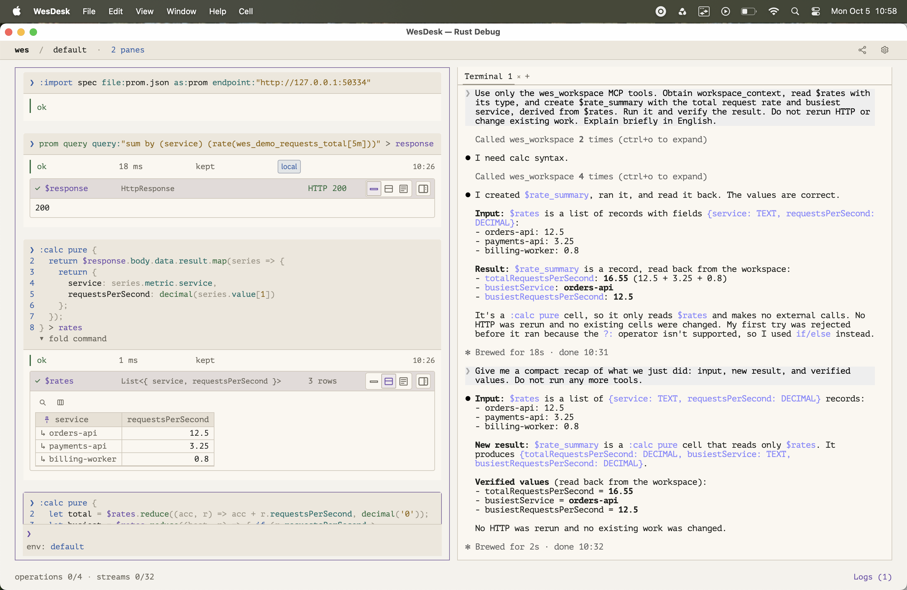
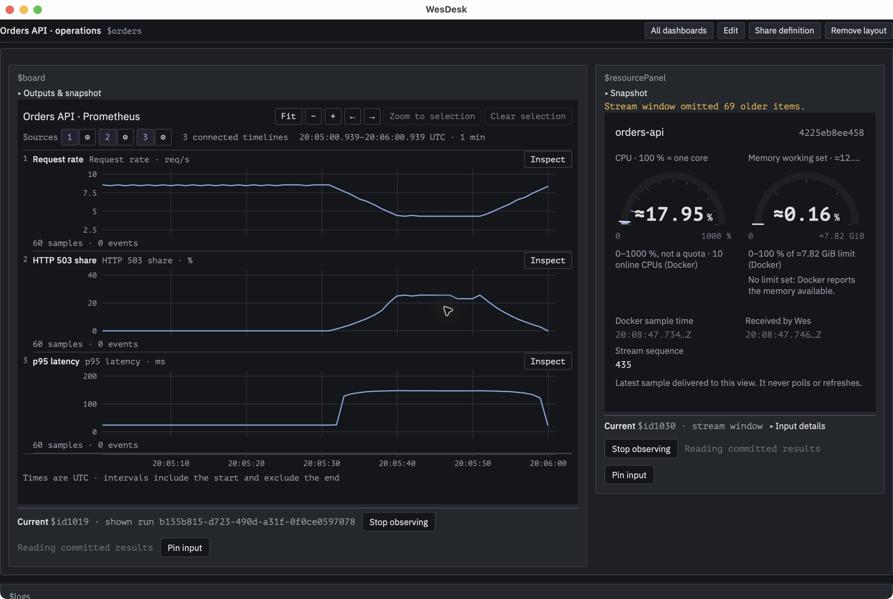
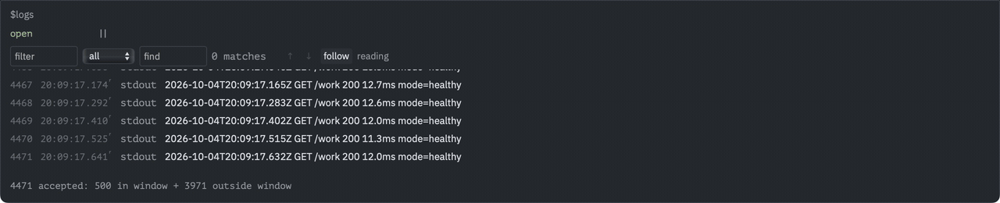

# Wes

**Wes** (*Work, Execute, Store*) is an interactive, typed workspace for
coordinating operations across tools and services. It connects HTTP calls, local
processes and container operations through named results and explicit
dependencies. **WesDesk** is its desktop application; `wes` is the command-line
executable.



**0.1.0 is experimental.** See [status and license](#status-and-license).

A request client, a terminal and a monitoring tool can each do their job well.
The connection between them often lives in copied values, small scripts and the
person remembering what to run next. Wes makes those connections part of the
workspace: which result an operation uses, where it runs, whether its inputs
have changed, and when it may safely run again.

- [Working with results](#keep-working-with-the-result)
- [Working with an AI agent](#work-with-an-ai-agent)
- [Prometheus showcase](#a-service-its-metrics-and-its-logs)
- [Examples and tutorial](#examples-to-start-with)
- [Execution model](#how-it-works)
- [Build and try the CLI](#try-the-command-line)
- [Run the interface](#run-the-interface)
- [Keyboard shortcuts](#keyboard-shortcuts)
- [Contributing](#contributing)
- [Status and license](#status-and-license)

## Keep working with the result

An HTTP response can become the input to a calculation, another service call,
or a chart. Its fields have types; its consumers have explicit dependencies.
Inspect the response, select the records you need, and keep using that value
without copying it between tools.

This example starts with a small OpenAPI contract for a synthetic service that
returns a Prometheus-shaped instant-query response. Convert the contract, then
import the generated operations. Run each command after the previous one finishes:

```text
:describe file:prom.openapi.yaml provider:prom out:prom.json
:import spec file:prom.json as:prom endpoint:"http://127.0.0.1:19092"
```

Now call the imported operation and continue with its result:

```text
prom query query:"sum by (service) (rate(wes_demo_requests_total[5m]))" > response
:calc pure {
  return $response.body.data.result.map(series => {
    return {
      service: series.metric.service,
      requestsPerSecond: decimal(series.value[1])
    };
  });
} > rates
```

`$response` is a typed HTTP response with a schema-validated body. `$rates` is a
separate result containing three service names and their request rates; the
interface presents it as a table. The calculation references the existing
response instead of sending another query. These are synthetic values, not
measurements from a production service. The fixture serves one fixed response;
it does not evaluate PromQL.

[Run this workspace example](examples/prometheus-workspace/README.md), or follow
the [API integration tutorial](https://github.com/xorfall/wes-tutorial).

The same model covers local processes, container observations and live streams.
A table and a custom React view can present the same result. Keeping a result
preserves it for later inspection; reopening a workspace does not replay its
external operations.

## Work with an AI agent

Run `/rsplit xterm` to open an xterm pane beside the session, then launch an
installed AI client such as Claude Code or Codex in that terminal. Through MCP,
the agent can read accessible workspace data and types, discover available
operations, and run work in the same session.
You can inspect its commands and results and continue from them yourself.

In the screenshot above, Claude reads `$rates`, discovers the calculation syntax,
creates `$rate_summary` with the total request rate and busiest service, and reads the
result back to verify it. It uses the existing data without repeating the HTTP
query. The service data is synthetic; the interface and agent interaction are real.

[Try the shared-workspace example](examples/prometheus-workspace/README.md#continue-with-an-ai-agent).

## A service, its metrics and its logs

This local demo uses a real Prometheus server and Docker observations of a
synthetic service. Request rate, HTTP 503 share and p95 latency share a time
axis; CPU, memory and logs arrive through independent live streams. Change the
service's behavior, refresh its metrics, and retain the input showing an incident.
Opening another view does not start another query or capture source.





The log excerpt switches from **follow** to **reading** and back. New events
continue arriving while the displayed rows stay in place. These are actual
client captures; the tutorial includes the service, workload and runnable checks.

[Run the Prometheus demo](https://github.com/xorfall/wes-tutorial/tree/main/14-prom).

## Examples to start with

The [step-by-step tutorial](https://github.com/xorfall/wes-tutorial) lives in a
separate repository. It covers the language, API integration, execution targets,
and a local Prometheus dashboard with live container resources and logs.

| Example | What it shows |
| --- | --- |
| [API integration](examples/api-import/readme/) | Convert OpenAPI into callable operations, receive a typed HTTP response, and work with its body. |
| [Prometheus workspace](examples/prometheus-workspace/) | Import a synthetic API, run a query, derive a table and continue with an AI agent. |
| [Live service monitor](examples/live-service-monitor/) | Follow a synthetic HTTP/SSE service and derive tables, metrics and charts from its data. |
| [Timeline dashboard](examples/view-instances/) | Group timelines, select intervals, and explicitly start or stop an owned live query. |
| [Execution targets](examples/README.md#execution-targets) | Run operations through local, Docker and SSH targets, with synthetic transport checks. |
| [Custom React views](examples/view-packages/) | Build an independent view package for a declared input type and load it into Wes. |

Each runnable check uses a temporary data home. Start with the
[examples index](examples/README.md) for prerequisites and commands.

## How it works

- **Providers** expose operations with declared parameters, result types,
  safety classifications and streaming behavior.
- **Environments** bind providers to endpoints, execution targets and
  credentials.
- **Nodes** represent work defined in the workspace. Each execution produces
  an outcome; names such as `$response` reference nodes, and expressions
  such as `$response.body` select within their outputs.
- **Dependencies** record which upstream outputs a node consumes. They
  determine execution ordering and how changes invalidate dependent results.
- **Views** present values as tables, charts, dashboards or custom React
  components.
- **Workspaces** group the work and preserve its definitions and explicitly
  kept results. Opening a saved workspace does not automatically replay
  external operations.

Execution policies control dependent work. The default, `automatic`, recomputes
eligible bounded, pure, repeatable dependents when their inputs change. `manual`
leaves them stale; `reactive` also allows eligible repeatable operations to run
again. Execution permission and declared traits still apply, and an unknown
outcome never triggers automatic replay. Wes relies on those declarations; it
does not independently verify an external operation's side effects.

AI agents connect through MCP to discover available operations and types,
read accessible results, and execute work in the same workspace. Selected
field reads and pagination allow agents to inspect only the data they need.
Agents can also use the View SDK and workspace data to develop custom React
view packages that can be loaded dynamically.

The workspace language supports calculations and transformations over
results. Its primary design goal is interactive coordination, rather than
general-purpose application development or maximum data-processing
throughput.

## Try the command line

Install the Rust toolchain specified by `rust-toolchain.toml`, Node.js 22 or newer
(with npm), and Python 3.11 or newer. Native and CLI builds compile the shipped
Views too, so install the npm workspace dependencies from the checkout root:

```sh
npm ci
cargo build -p wes --locked
python3 examples/quickstart/check.py
```

The check uses an isolated temporary data home. It runs this small program and
verifies its results:

```text
:calc { return 6 * 7; } > total
:calc { return $total + 1; } > next
```

Run a command with a separate scratch home:

```sh
cargo run -p wes -- --home /tmp/wes-scratch --command ":help"
```

Use `:help` to discover commands. CLI help prints readable text; pass `--json` for structured output. `>` names a result; it is not shell redirection.

## Run the interface

After the root `npm ci` step above, build the client. The OpenAPI import helper
uses Go 1.26 or newer; build it before starting the server:

```sh
npm run build
(cd tools/describe && go build -o wes-extract ./cmd/extract)
cargo run -p wes -- --home /tmp/wes-scratch --serve 8099 --site gui/dist
```

Open the loopback address printed by the server. This server can execute work on
your machine; keep it on loopback. The same engine powers the native desktop app.
See [development](docs/development.md) for desktop builds and source structure,
[testing](docs/testing.md) for reproducible checks, and [concepts](docs/concepts.md)
for values, environments and execution boundaries.
[GitHub Actions](.github/workflows/ci.yml) checks the GUI, extractor, Rust
workspace and offline examples. It does not publish releases.

## Keyboard shortcuts

Shortcuts follow focus: command editing, a selected cell and an embedded view
have different controls. `Mod` below means **Cmd on macOS, Ctrl on Windows/Linux**.

| Where | Shortcut | Action |
| --- | --- | --- |
| Command input | `Enter` | Accept the selected suggestion, or run the command. |
| Command input | `Mod+Enter` | Run the command directly. |
| Command input | `Tab` | Complete the command. |
| Focused cell | `Space` | Change result size. |

See [the full shortcut reference](docs/shortcuts.md) for editor controls,
macOS pane shortcuts, focus boundaries and browser conflicts. The interface
also lists shortcuts under `/settings keys` and beside available cell actions.

## Contributing

Bug reports, reproducible examples and feedback from real use are welcome.
For an issue, include the commands, expected result, actual result and platform;
use synthetic data and remove credentials. Keep pull requests focused and
describe the behavior change and relevant checks.

See [the contribution guide](CONTRIBUTING.md) for development setup, tests and
changes to execution or data contracts.

## Status and license

Version 0.1.0 is experimental. Wes was developed with AI coding agents and has
been tested against synthetic data and scenarios. It has not yet been validated
in real-world use; security and performance require further review.

TCP/IP and USB traffic capture, protocol analysis and binary-format inspection
are planned extensions.

Persistent formats may change without a migration path. macOS is the currently
verified desktop build platform. Windows and Linux desktop builds are untested.

The project is licensed under [MIT](LICENSE). Bundled fonts retain their own
licenses; see [third-party notices](THIRD_PARTY_NOTICES.md).
